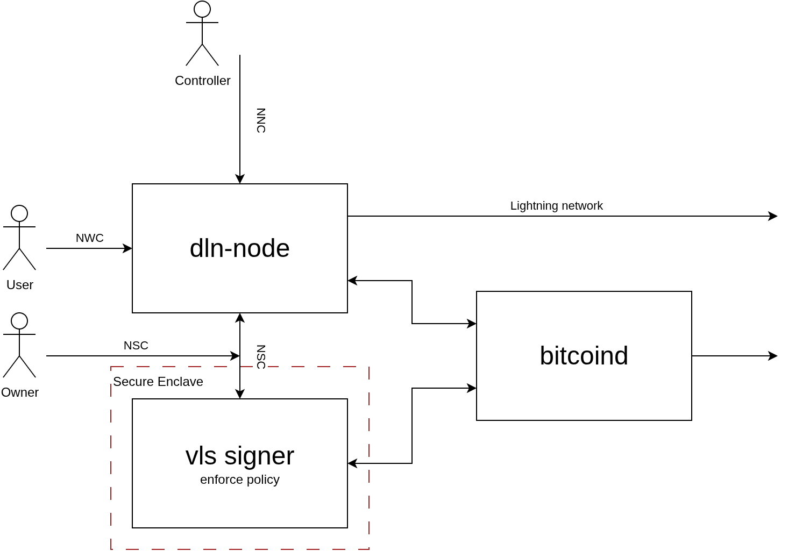

# Diamond Lightning Node

`dln-node` -- the Diamond Lightning Node -- is a security-focused Lightning
node. Like a diamond, it is designed to be transparent and hard, and to be
produced through a controlled development process.

Its design goals are:

- **Transparent:** user-auditable and licensed under GPLv3.
- **Hard:** a small attack surface, minimal components, defensive coding, and
  functional design.
- **Controlled:** a defined process for developing, reviewing, verifying,
  releasing, and deploying the software.

It is built around [`ldk-node`] and controlled entirely through Nostr. It can
operate without holding its own keys by delegating signing to an external
signer, which may run inside a secure enclave.

It takes its chain data from a Bitcoin Core RPC endpoint, exposes no HTTP or
gRPC surface, and delegates signing to an external signer that can live in
another process — or, for tests, in-process or not at all.

**It implements handlers and nothing else.** Since mission 25.3 the
protocol itself — the request pipeline, grants, rate and quota buckets,
event kinds, NIP-44, the relay loop and notification delivery — lives in
[`nostr-ln`](https://github.com/DarkWebDivingClub/nostr-rs-ln), shared with
every other consumer. This repository is `src/wallet.rs` (twenty-three NWC
methods), `src/control.rs` (fourteen NIP-XX methods), `src/events.rs` (LDK
events as notifications) and `src/lightning/` (the node). `src/lib.rs` is
seventy-six lines and declares modules.

That is not a tidying. Five open issues lived in the deleted code and none
was migrated: grants applied without checking who signed them, a profile
field spelled `access_rate` where the specification says `rate`, NIP-04
accepted where the specification says NIP-44, and two bugs in the bucket
arithmetic that meant rate limits never refilled. A handler cannot get any
of them wrong because a handler cannot reach them.

## Protocol development

`dln-node` is both a Lightning node implementation and a proving ground for
open Nostr protocols for operating secure Lightning infrastructure.

The project develops and tests a three-part protocol suite:

| Protocol | Purpose | Status |
| --- | --- | --- |
| **NWC** | Wallet operations, including invoices, payments, offers, and on-chain operations | Extends NIP-47 with candidate methods and capabilities |
| **NCC** | Lightning node control, including channels, peers, fees, routing, and network queries | Developing protocol proposal |
| **NSC** | Communication with an external signer and enforcement of signing policy | Developing protocol proposal |

The goal is to refine these protocols through working implementations,
interoperability testing, and operational experience, then propose the
resulting extensions for adoption as open standards.

Until those proposals are accepted, functionality described as an extension
or proposal is implementation-specific and should not be assumed to be part
of an established NIP.



The architecture separates three human roles:

- The **Owner** defines the signing policy enforced by the external signer.
- The **User** uses the wallet through NWC, within the permissions and limits
  granted by the Owner.
- The **Controller** operates the Lightning node through NCC, subject to the
  Owner's policy and its granted capabilities.

The node communicates with the signer through NSC. Keeping policy enforcement
in the signer means that a wallet user or node controller cannot make the
signer approve an operation outside the Owner's policy merely by controlling
`dln-node`.

## Nostr protocol suite

Nostr is the node's only API. There is no CLI, HTTP or gRPC API, or local
control socket. The protocol suite separates wallet operations, node control,
and signing into distinct interfaces.

This separation is deliberate: each protocol has a focused responsibility,
can evolve independently, and can be implemented by other clients, nodes, and
signers.

| Protocol | Responsibility | Current implementation |
| --- | --- | --- |
| **NWC** | Wallet operations | NIP-47 plus candidate extensions |
| **NCC** | Node control | Kinds 23198 and 23199, encrypted with NIP-04 |
| **NSC** | External signing and policy enforcement | Nostr signer transport |

### NWC and its extensions

On NWC, that means `get_info` and `get_balance`; `make_invoice`,
`lookup_invoice`, `list_invoices` and `pay_invoice`; the hold-invoice
primitives `make_hold_invoice`, `settle_hold_invoice` and
`cancel_hold_invoice`; keysend; BOLT12 offers; and the on-chain set
(`pay_onchain`, `make_new_address`, `list_addresses`, `list_transactions`,
and fee estimation).

Every one of them is defined by a published specification: NIP-47 core, an
upstream NWC extension (02, 03, 04, 05, 09, 12), or a draft of ours in the
[`nips`](https://github.com/DarkWebDivingClub/nips) repository —
`nwc-onchain.md`, `nwc-offers.md`, `nwc-invoices.md`, `nwc-bip321.md`,
`nwc-route.md` and `nwc-units.md`. **No method is implemented against a
fork.** Mission 25.1 moved the last of them out of our forked `47.md` and
put that file back to upstream's core, and 25.2 typed every one in
`nostr-ln`.

Hold invoices were "a candidate extension provided through our fork" when
this paragraph was first written. They are NWC-03, adopted, with vectors
generated from the specification's own examples.

**`src/wallet.rs` is the authoritative list of methods this node
implements**, and it is more than documentation: `#[nostr_ln::service]`
generates the kind-13194 info event from that impl block, so the node
cannot advertise a method it does not serve. It used to — `estimate_onchain_fees`
was registered and returned `NOT_IMPLEMENTED` — and that is now
unrepresentable.

### NCC

NCC is the proposed node-control protocol. It covers `open_channel`,
`list_channels`, `close_channel`, `connect_peer`, `disconnect_peer`,
`list_peers`, `get_channel_fees`, `set_channel_fees`,
`get_forwarding_history`, `query_routes`, network queries, and
`subscribe_notifications`.

`dln-node` currently uses kind 23198 for requests and kind 23199 for responses,
with NIP-04 encryption. These assignments and message formats are under active
development towards a standards proposal.

NWC and NCC are gated by **grants**: kind-30078 events addressed with a `d` tag
of `{service_pubkey}:{client_pubkey}`. A grant carries an optional client-wide
`quota`, a **`methods`** map for NWC, and a **`control`** map for NCC. Each map
entry defines a per-method `access_rate`. Authorisation is per method *and* per
client key, so different clients can hold different capabilities on the same
node. A method absent from the grant is refused with `Restricted`.

## Signing and NSC

NSC is the proposed interface between a node and an external signer. Its
purpose is to keep raw keys outside the node and allow an independent signer
to validate every signing request against policy.

The `nostr` signer transport is the current implementation used to develop and
test this protocol. The goal is an interoperable interface that can be
implemented by independent nodes, signers, and secure-enclave deployments.

On the default paths, the node never sees raw keys. LDK's `KeysInterface` is
backed by a signing client. Every signing operation is sent to the signer,
which validates it against policy and may refuse it.

`signer.transport` selects the signing mode:

| Mode | Where keys live | Policy validation | Use |
|---|---|---|---|
| `nostr` | separate signer process, reached over a relay | full | production |
| `embedded` | in-process signer, no transport | two routing-balance policies downgraded to warnings | tests |
| `none` | the node itself, via ldk-node's own `KeysManager` | none | bring-up only |

`embedded` also runs without a state persister, so signer state does not
survive a restart.

`none` bypasses the signer entirely. It exists because two nodes running
embedded signers derive the same `node_id` and therefore cannot peer with each
other, which makes multi-node scenarios impossible. **It is not a production
configuration**: the node holds its own keys, and nothing validates what it
signs.

## Configuration

The node reads `config.toml` from its working directory:

```toml
[node]
network = "regtest"          # regtest | testnet | signet | bitcoin
listening_port = 9735
data_dir = "./data"
# alias = "optional"

[nostr]
relay = "ws://localhost:7777"
private_key = "<nsec or hex>"
owners = ["<owner pubkey hex>"]         # required; see below

[wallet]
max_channel_size_sats = 10000000
min_channel_size_sats = 20000
auto_accept_channels = false

[bitcoind]
rpc_host = "127.0.0.1"
rpc_port = 18443
rpc_user = "rpcuser"
rpc_password = "rpcpass"

[signer]
transport = "nostr"                     # nostr | embedded | none
relay = "ws://localhost:7777"           # nostr transport only
nsec = "<node proxy nsec hex>"          # nostr transport only
signer_pubkey = "<signer pubkey hex>"   # nostr transport only
```

**`nostr.owners` is required.** It lists the public keys whose grants this
node accepts, and **an empty list accepts none — the node will answer
nothing.** Absent configuration fails closed rather than being read as
"any owner", which is
[#1](https://github.com/DarkWebDivingClub/dln-node/issues/1): the node
previously kept an owners list that nothing ever wrote to, so it applied
every grant it saw whatever key had signed it.

`[bitcoind]` is required. It was optional, and omitting it started a
service with no Lightning node attached — which could answer nothing
useful, so the case is gone rather than silently degraded.

`[signer]` is optional. **Omitting it selects `embedded`** — an in-process
signer with two routing-balance policies downgraded to warnings. This mode
is intended for testing and should not be selected implicitly in
production.

## Building

```console
cargo build --bin dln-node
```

## Testing

End-to-end scenarios live in [`dln-node-e2e-test`], which drives real nodes against
a Bitcoin Core regtest container:

- `two_dln_nodes` — opens a channel, creates an invoice, and completes a
  Lightning payment between two nodes
- `onchain_payment` — sends an on-chain payment and verifies it through
  Bitcoin Core
- `hold_invoice` — tests both settlement and cancellation of a held HTLC

They run with `transport = "none"`, because two nodes with embedded signers
derive the same `node_id` and cannot peer.

Scenarios for the XBT chain are in [`dln-node-knots-e2e-test`], and the exchange
built on this node is tested in [`diamond-x-e2e-test`], which also carries the
harness all three share.

### This repository's own tests

Twelve files, down from fifty-nine. The fifty-two that went were **protocol
tests wearing method names**: they published a grant, sent a request over a
relay and checked a response, and that pipeline is `nostr-ln`'s now, tested
by its own suites and by
[`nostr-rs-ln-e2e-test`](https://github.com/DarkWebDivingClub/nostr-rs-ln-e2e-test)
over a real relay for every method.

[`doc/test-coverage-after-25.3.md`](doc/test-coverage-after-25.3.md) maps
each deleted group to what covers it now. Keeping that map is the condition
under which deleting them was acceptable.

What remains tests this repository and not the protocol: the handler
against a real LDK node and `bitcoind`, peer connect and disconnect, and a
blackbox test that builds the binary, writes a `config.toml` and runs it.

[`dln-node-e2e-test`]: https://github.com/DarkWebDivingClub/dln-node-e2e-test
[`dln-node-knots-e2e-test`]: https://github.com/DarkWebDivingClub/dln-node-knots-e2e-test
[`diamond-x-e2e-test`]: https://github.com/DarkWebDivingClub/diamond-x-e2e-test

[`ldk-node`]: https://github.com/lightningdevkit/ldk-node
